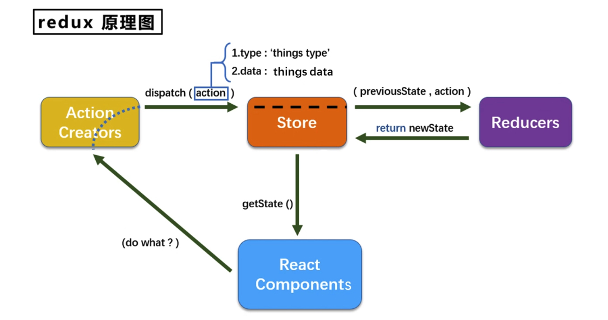

# redux demo

直接看 [react-redux](#react-redux) 的用法

代码地址: https://github.com/tangx/react_scaffolding_jsx/tree/redux_test


## redux 使用



## 安装

```bash
$ yarn add redux
```


## 注意事项

### render 刷新页面

**对于某个组件**

在 [Count.jsx](./src/components/Count.jsx) 中， 通过 store 修改了值， 但是不会引起页面的渲染。
通过 `store.subscribe()` 订阅 store 值之后， 通过 `this.setState({})` 通知 react 重新渲染刷新。


```js
  // 渲染页面
  componentDidMount() {
    store.subscribe(() => {
      this.setState({})
    })
  }
```

**对于所有页面**

当然， 当组件越来越多的时候， 单独调用回造成代码冗余

可以在 [index.js](./src/index.js) 中订阅， 刷新整个 App

```js
import store from './redux/store';

const root = ReactDOM.createRoot(document.getElementById('root'));

// 第一次渲染
root.render(
  <React.StrictMode>
    <App />
  </React.StrictMode>
);

// 订阅变化渲染
store.subscribe(() => {
  root.render(
    <React.StrictMode>
      <App />
    </React.StrictMode>
  );
})
```


## action

1.  同步: action 为 `object{}` 一般对象。
2.  异步: action 为 `function` 函数对象。

store 本身只能处理 **一般对象**。 

```
Uncaught Error: Actions must be plain objects. Instead, the actual type was: 'function'. You may need to add middleware to your store setup to handle dispatching other values, such as 'redux-thunk' to handle dispatching functions. See https://redux.js.org/tutorials/fundamentals/part-4-store#middleware and https://redux.js.org/tutorials/fundamentals/part-6-async-logic#using-the-redux-thunk-middleware for examples.
```
如果是异步 action（函数）， 则需要使用 **中间件** `redux-thunk` 帮忙处理。

```bash
$ yarn add redux-thunk
```


```js

// store.js
import thunk from 'redux-thunk'
const middlewareEnhancer = applyMiddleware(thunk)

export default legacy_createStore(countReducer, middlewareEnhancer)


// action.js
export function createIncrementAsyncAction(data, timeout) {
  return (dispatch) => {
    setTimeout(() => {
      dispatch(createIncrementAction(data))
    }, timeout);
  }
}
```


## react-redux


```bash
$ yarn add react-redux
```


1. 明确两个概念：
    1. UI组件： 不能使用任何 redux 的 api， 只负责页面的呈现、交互等。
    2. 容器组件： 负责和 redux 通信， 将结果交给 UI 组件。
2. 如何创建一个容器组件： 使用 react-redux 的 connect 函数。
    1. 如代码

3. 备注： 容器组件中的 store 是通过 props 传递进去的。 而不是直接在容器中直接引用。

```js
// 引入 Count 的 UI 组件
import CountUI from '../components/Count'
// 引入 connect 用于连接 UI 与 redux 组件
import { connect } from 'react-redux'

import {
  createIncrementAction,
  createDecrementAction,
  createIncrementAsyncAction
} from '../redux/count_action'

// 传递状态：
// states 函数的返回值作为状态传递给了 UI 组件
// 返回值必须是一个对象
//   state = store.getState()
function mapStateToProps(state) {
  return {
    count: state
  }
}

// 传递操作状态的方法：
// methods 函数传递操作方法。
//    dispath = store.dispatch
function mapDispatchToProps(dispatch) {
  return {
    add: (data) => {
      // 通知 redux 执行加法
      dispatch(createIncrementAction(data))
    },
    asyncAdd: (data) => {
      dispatch(createIncrementAsyncAction(data, 500))
    }
  }
}

// connect 可以传递两个函数， 且必须为函数
export default connect(mapStateToProps, mapDispatchToProps)(CountUI)
```

### connect 函数传参优化

```js

/** dispatchProps 可以简单写成一个 object 对象。 如下。
 *    1. action 函数不用带参数签名。
 *    2. 不用专门使用 dispatch 包裹函数。
 */
const dispatchProps = {
  add: createIncrementAction,
  asyncAdd: createIncrementAsyncAction
}


// connect 可以传递两个函数， 且必须为函数
// export default connect(mapStateToProps, mapDispatchToProps)(CountUI)
export default connect(mapStateToProps, dispatchProps)(CountUI)
```

### 页面渲染优化

使用了 `react-redux` 之后， 不用自己在 `index.js` 中使用 `store.subscribe()` 状态变化。


### 使用 Provider 对 store 的传递优化

使用 Provider 组件后， 其所有 container 类型的子组件都可以收到 `store={store}`。
不用在单独写了。
因此， 通常将 Provider 放在 `index.js` 中， 最上层

```js
// index.js

import store from './redux/store'
import { Provider } from 'react-redux'

const root = ReactDOM.createRoot(document.getElementById('root'));

// 默认
// root.render(
//   <React.StrictMode>
//     <App />
//   </React.StrictMode>
// );

// 使用 Provider 优化 store 的传递
//  1. 使用 Provider 包裹 App 组件
//  2. 为 Provider 传入 store={store}
root.render(
  <React.StrictMode>

    <Provider store={store}>
      <App />
    </Provider>
  </React.StrictMode>
);
```

在子组件中， 

```js
// App.jsx

import Count from './containers/Count';
// import store from './redux/store';


export default class App extends Component {
  render() {
    // Count Container 不在单独传递 store={store}
    return (
      <div className='App'>
        {/* <Count store={store} /> */}
        <Count />
      </div>
    )
  }
}
```

### 文件整合优化

根据实际情况， 不一定非要将 **UI组件** 与 **Container组件** 分开成多个文件。 
也可以 **合并** 成 **一个文件**。 


```js

// 引入依赖
import { connect } from 'react-redux'
import React, { Component } from 'react'


// 定义非内部组件
class CountUI extends Component {
  render() {
    return (
      <div>
        <h3>CountUI</h3>
      </div >
    )
  }
}

// 默认暴露 Container 组件
const Count = connect(mapStateToProps, dispatchProps)(CountUI)
export default Count
```

## 数据共享

1. 工程化目录结构， 
    1. 将所有 action 文件放在 `redux/actions` 目录下， 文件以组件命名。 reducer 同理。
    2. `constant.js` 和 `store.js` 使用一个即可

```bash
$ tree src/redux 
    src/redux
    ├── actions
    │   ├── count.js
    │   └── people.js
    ├── constant.js
    ├── reducers
    │   ├── count.js
    │   └── people.js
    └── store.js
```

2. 定义一个新组件 People。 并准备 action, reducer 和 People组件。
3. 具有多个 reducer 的时候，
    1. 必须使用在 `redux/store.js` 中 `combineReducers` 将其合并成一个 object 对象。
    2. 并为每个 reducer 创建一个 key 名字， 方便调用


```js
// 引入 thunk 帮助实现异步调用
import thunk from 'redux-thunk'
const middlewareEnhancer = applyMiddleware(thunk)

// 引入为 count 组件服务的 reducer
import countReducer from './reducers/count'
import peopleReducer from './reducers/people'

// 注意这里的 key 值
const allReducers = combineReducers({
  count: countReducer,
  people: peopleReducer,
})

export default legacy_createStore(allReducers, middlewareEnhancer)
```

在 container 组件中使用 redux state 数据， 需要指定 key 获取

```js
// src/containers/People.jsx
function stateProps(state) {
  return {
    count: state.count,
    people: state.people
  }
}

const dispatchProps = {
  addUser: createPeopleAddUserAction
}

export default connect(stateProps, dispatchProps)(People)
```

4. 在 container 组件中获取 redux 数据时， 取出 **期望使用的实际状态**， 避免过度数据传递。

```js
// src/containers/Count.jsx

function mapStateToProps(state) {
  return {
    count: state.count,
    peopleCount: state.people.length, // 在本地就计算完成人数。 而不是在 CountUI 中计算
  }
}


```

## 纯函数

**纯函数** 是一类特别的函数， 只要是同样的输入（实际参数）， 就必定得到同样的数据（返回值）。

纯函数必须遵守一下规则

1. 不得修改数据
2. 不会产生任何副作用， 例如网络请求， 输入和输出设备。
3. 不能调用 `Date.now() 或者 Math.random()` 等不纯的方法。

**redux 的 `reducer`** 必须是一个纯函数。


```ts
// 纯函数
function pure(n: number): number{
    return n*3
}


// 非纯函数
function nonPure(arr: number[],n:number): number[]{
    arr.shift(n)
    return arr
}
```


## redux 开发者工具

在浏览器中安装扩展

Chrome extension: [Redux DevTools](https://chrome.google.com/webstore/detail/redux-devtools/lmhkpmbekcpmknklioeibfkpmmfibljd/related?utm_source=chrome-ntp-icon)

在项目中安装工具扩展

```bash
$ yarn add redux-devtools-extension
```


在使用开发开发者工具时

```js

// 引入为 count 组件服务的 reducer
import countReducer from './reducers/count'
import peopleReducer from './reducers/people'

const allReducers = combineReducers({
  count: countReducer,
  people: peopleReducer,
})


import thunk from 'redux-thunk'
const middlewareEnhancer = applyMiddleware(thunk)

/** 不使用 redux 开发者工具 */
// export default legacy_createStore(allReducers, middlewareEnhancer)

/** 使用 redux 开发者工具， 需要将中间件作为 参数 传递给 composeWithDevTools */
// 引入 redux 开发者工具， 这是一个插件
import { composeWithDevTools } from 'redux-devtools-extension'

export default legacy_createStore(
  allReducers,
  composeWithDevTools(middlewareEnhancer),
)
```


## 最后的优化

1. 所有变量名要 **尽量** 规范。 尽量触发对象简写形式， 保证 **变量名** 统一。

```ts
const abc:number = 1
const def:number = 2
const obj={
    // 完整形式
    Abc: abc, // 别名: 真实名字
    abc: abc, // 别名与真实名字相同

    // 简写形式： 等同于 def:def,
    def,  
}

console.log(obj.Abc) // 1
console.log(obj.abc) // 1
console.log(obj.def) // 2
```

2. `redux/reducers/` 目录中， 创建 `index.js` 文件， 专门用于汇总并暴露所有的 reducer。

```js
// redux/reducers/index.js

/** 
 * reducers/index.js 专门用于组合所有暴露的 reducer。 
 *    放在 reducers 目录下， 作为入口文件。 统一管理。
 */
import count from './count'
import people from './people'

import { combineReducers } from 'redux'

export default combineReducers(
  {
    count,
    people,
  }
)
```

在 `store.js` 文件中，  直接 import 组装好的所有 reducers

```js
// redux/store.js

// 不在 store.js 里面管理， 而是通过引入所有 reducers
import reducers from './reducers'

import thunk from 'redux-thunk'
const middlewareEnhancer = applyMiddleware(thunk)

/** 不使用 redux 开发者工具 */
export default legacy_createStore(allReducers, middlewareEnhancer)
```